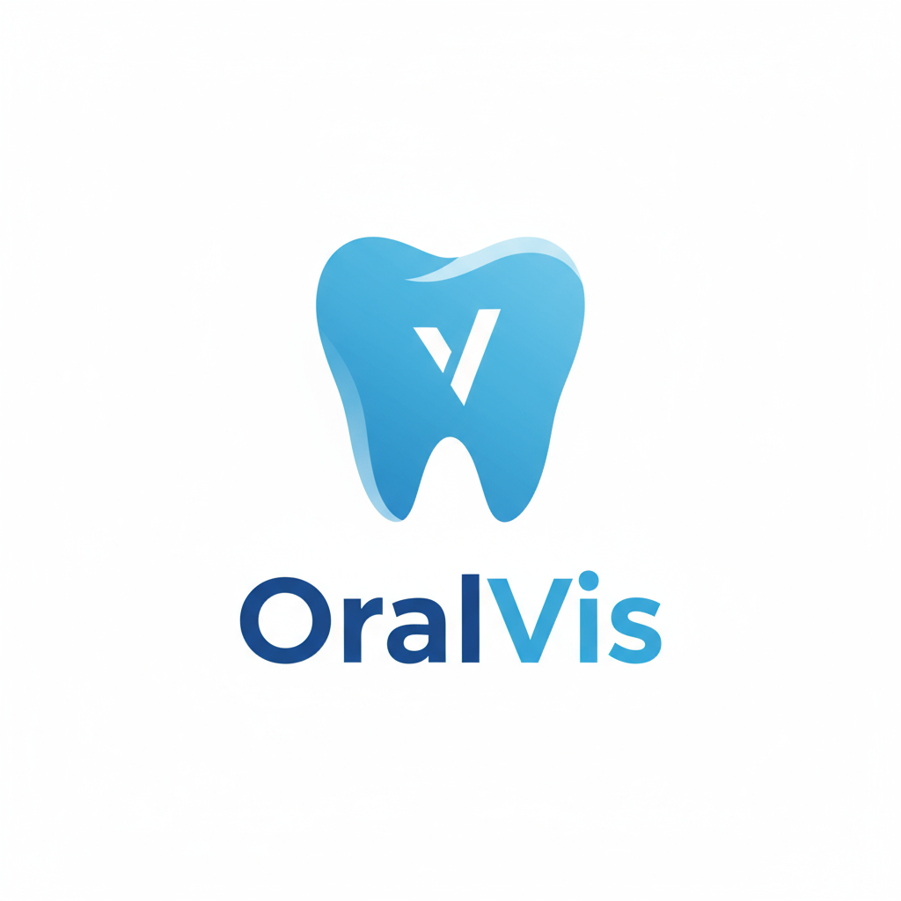

# OralVis Healthcare - Dental Screening & Annotation Platform

<div align="center">
  
</div>

<p align="center">
  <strong>A full-stack MERN application for remote dental screening, featuring secure patient submissions, a professional annotation dashboard, and automated PDF report generation.</strong>
</p>

<p align="center">
  <a href="https://oralvis-healthcare-nine.vercel.app/"><strong>Visit the Live Application »</strong></a>
</p>

---

## Table of Contents

- [Live Demo & Credentials](#live-demo--credentials)
- [Key Features](#key-features)
- [Technology Stack](#technology-stack)
- [Future AI Integration](#future-ai-integration)
- [Project Structure](#project-structure)
- [Getting Started](#getting-started)
- [Deployment](#deployment)
- [Author](#author)
- [License](#license)

---

## Live Demo & Credentials

The application is fully deployed and accessible at the link below. You can register as a new patient or use the provided admin credentials to explore the professional dashboard.

- **Live Application URL:** [https://oralvis-healthcare-nine.vercel.app/](https://oralvis-healthcare-nine.vercel.app/)

### Admin Credentials

Log in with the following details to access the administrator dashboard, view all submissions, and use the annotation tools.

- **Email:** `admin@oralvis.com`
- **Password:** `admin123`

---

## Key Features

- **Dual User Roles:** Secure JWT-based authentication for both **Patients** and **Admins**.
- **Patient Dashboard:** Patients can upload dental images, add descriptive notes, view the status of their submissions, and download their final PDF reports.
- **Secure Cloud Storage:** Integrates with **Amazon S3** for secure, scalable storage of all patient images and generated PDF reports.
- **Admin Dashboard:** A central hub for dental professionals to view and manage all patient submissions with status filters (`Pending`, `Processed`, `Rejected`).
- **Advanced Annotation Tool:** A powerful, in-browser image annotation tool built with **Konva.js** allowing professionals to draw rectangles, circles, and arrows to highlight areas of concern.
- **Automated PDF Report Generation:** Generate professional, multi-page PDF reports that include patient details, the original image, the expert-annotated image, and general recommendations.

---

## Technology Stack

### Frontend
- **React.js** & **React Router**
- **Ant Design (AntD)** for UI components
- **Konva.js** & **react-konva** for the annotation canvas
- **Axios** for API communication

### Backend
- **Node.js** & **Express.js** for the RESTful API
- **MongoDB** with **Mongoose** for database management
- **JSON Web Tokens (JWT)** for authentication
- **bcrypt.js** for password hashing
- **Multer** & **Multer-S3** for handling file uploads
- **pdfkit** for server-side PDF generation

### Cloud & DevOps
- **Amazon S3**: For cloud object storage.
- **Vercel**: For frontend deployment.
- **Render**: For backend deployment.

---

## Future AI Integration

This platform is **AI-Ready**. The next logical step is to integrate a machine learning model to provide diagnostic assistance. The workflow would be:
1.  A patient uploads an image.
2.  The image is sent to a dental AI model (via an API) for analysis.
3.  The model returns suggested annotations (e.g., identifying potential caries, inflammation).
4.  These suggestions are pre-loaded in the annotation tool for the dental professional to review, modify, or approve, significantly speeding up the review process.

---


---

## Getting Started

To get a local copy up and running, follow these simple steps.

### Prerequisites

- Node.js (v18.x or later)
- npm
- A MongoDB Atlas account
- An AWS account with S3 credentials

### Installation

1.  **Clone the repo:**
    ```
    git clone https://github.com/bhaskar747/oralvis-healthcare.git
    cd oralvis-healthcare
    ```

2.  **Set up the backend:**
    ```
    cd backend
    npm install
    # Create a .env file and add your environment variables (see README section in code)
    ```

3.  **Set up the frontend:**
    ```
    cd ../frontend
    npm install
    # Create a .env file with REACT_APP_API_URL=http://localhost:5000
    ```

4.  **Run the application:**
    - Run the backend: From the `/backend` directory, run `npm run dev`.
    - Run the frontend: From the `/frontend` directory, run `npm start`.

---

## Deployment

The application is deployed with a dual-host strategy:
- **Backend:** The Node.js server is deployed as a **Web Service** on **Render**.
- **Frontend:** The React application is deployed as a static site on **Vercel**.

Environment variables are configured directly on their respective hosting platforms for production builds.

---

## Author

- **Bhaskar Reddy Chinthakunta**
- **GitHub:** [bhaskar747](https://github.com/bhaskar747)
- **LinkedIn:** [bhaskarreddychinthakunta](https://www.linkedin.com/in/bhaskarreddychinthakunta/)

---

## License

Distributed under the MIT License.

